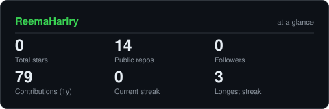
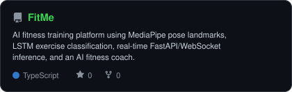
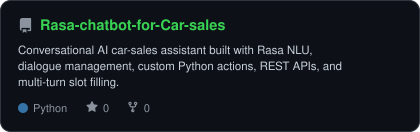
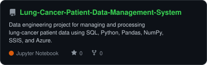
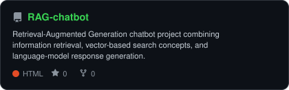

<p align="center">
  <a href="https://github.com/ReemaHariry">
    
  </a>
</p>

<p align="center">
  <a href="https://www.linkedin.com/in/reemahariry/"></a>
  <a href="mailto:reemahariry884@gmail.com"></a>
</p>


---

## `~/` whoami

```console
$ cat about.txt
```

Hi, I'm **Reema Ehab Aly ElHariry**. I'm focused on **Machine Learning and AI**, and I enjoy building practical, data-driven applications.

- GitHub: **[ReemaHariry](https://github.com/ReemaHariry)**
- LinkedIn: **[reemahariry](https://www.linkedin.com/in/reemahariry/)**
- Email: **[reemahariry884@gmail.com](mailto:reemahariry884@gmail.com)**

---

<h2 align="center"><code>~/</code> toolbox</h2>

<p align="center">
  
</p>

---

<h2 align="center"><code>~/</code> skill radar</h2>

<table>
<tr>
<td width="50%" align="center" valign="middle">
  <picture>
    <source media="(prefers-color-scheme: dark)" srcset="assets/radar-dark.svg">
    <source media="(prefers-color-scheme: light)" srcset="assets/radar-light.svg">
    
  </picture>
</td>
<td width="50%" align="center" valign="middle">
  <picture>
    <source media="(prefers-color-scheme: dark)" srcset="assets/radar-langs-dark.svg">
    <source media="(prefers-color-scheme: light)" srcset="assets/radar-langs-light.svg">
    
  </picture>
</td>
</tr>
</table>

---

<h2 align="center"><code>~/</code> contribution calendar</h2>

<p align="center">
  
</p>

<p align="center">
  <picture>
    <source media="(prefers-color-scheme: dark)" srcset="https://raw.githubusercontent.com/ReemaHariry/ReemaHariry/output/snake-dark.svg">
    <source media="(prefers-color-scheme: light)" srcset="https://raw.githubusercontent.com/ReemaHariry/ReemaHariry/output/snake.svg">
    
  </picture>
</p>

---

<h2 align="center"><code>~/</code> the numbers</h2>

<p align="center">
  <picture>
    <source media="(prefers-color-scheme: dark)" srcset="assets/card-stats-dark.svg">
    <source media="(prefers-color-scheme: light)" srcset="assets/card-stats-light.svg">
    
  </picture>
</p>

<p align="center">
  
</p>

<p align="center">
  
</p>

---

<h2 align="center"><code>~/</code> selected work</h2>

<table>
<tr>
<td width="50%">
  <a href="https://github.com/ReemaHariry/FitMe">
    <picture>
      <source media="(prefers-color-scheme: dark)" srcset="assets/card-FitMe-dark.svg">
      <source media="(prefers-color-scheme: light)" srcset="assets/card-FitMe-light.svg">
      
    </picture>
  </a>
</td>
<td width="50%">
  <a href="https://github.com/ReemaHariry/Rasa-chatbot-for-Car-sales">
    <picture>
      <source media="(prefers-color-scheme: dark)" srcset="assets/card-Rasa-chatbot-for-Car-sales-dark.svg">
      <source media="(prefers-color-scheme: light)" srcset="assets/card-Rasa-chatbot-for-Car-sales-light.svg">
      
    </picture>
  </a>
</td>
</tr>
<tr>
<td width="50%">
  <a href="https://github.com/ReemaHariry/Lung-Cancer-Patient-Data-Management-System">
    <picture>
      <source media="(prefers-color-scheme: dark)" srcset="assets/card-Lung-Cancer-Patient-Data-Management-System-dark.svg">
      <source media="(prefers-color-scheme: light)" srcset="assets/card-Lung-Cancer-Patient-Data-Management-System-light.svg">
      
    </picture>
  </a>
</td>
<td width="50%">
  <a href="https://github.com/ReemaHariry/RAG-chatbot">
    <picture>
      <source media="(prefers-color-scheme: dark)" srcset="assets/card-RAG-chatbot-dark.svg">
      <source media="(prefers-color-scheme: light)" srcset="assets/card-RAG-chatbot-light.svg">
      
    </picture>
  </a>
</td>
</tr>
</table>

<p align="center">
  <sub>Machine Learning • AI • Data Engineering • Generative AI</sub>
</p>
